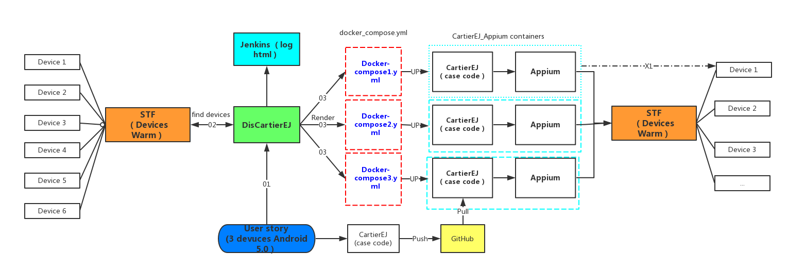

# 开源项目:小红书移动UI并发自动化测试实践之DisCartierEJ

@ Arthor: Juan Liu 
@ Date : 2017.06.03

## 相关背景

随着小红书发展，各种自动化产品也在逐渐使用，提高工作效率、节省时间，也更多的保证了正确性。在小红书，移动UI自动化方面，尝试的项目之一就是当前的这个DisCartierEJ项目。

在这个项目进行两个月左右的时候，我写了一篇文章总结了当时的思路[小红书自动化平台实践之 Cartier](https://testerhome.com/topics/7801)，主要是讲解了思路方面和架构方面，这次更多的是关注代码方面，在架构方面也有了一点点改进。

## 开源背景
1. 项目基本上达到了预期的目标，可以无连接的实现多台设备同时并行正确运行。
2. 开源出来，希望在大家使用的过程中，更加的优化项目和代码。
3. 实习快结束了，开源也是一次回头过来好好看看设计思路和代码的过程，优化交付给下一位同事。

## DisCartierEJ 的优点

1. 利用docker将appium及其依赖的工具放在一个容器中，这样使用者（比如开发或者其他相关测试人员等）只需要pull镜像文件，就可以运行了，不需要一个个去安装各种依赖，减去不必要的时间。ps：我刚接触的时候，花了一天多的时间装了各种软件，遇到各种配置问题，更会浪费许多时间，这些时间对仅仅使用的人来说，毫无必要，对需要开发的人来说，犯错还是有价值的。

2. 利用stf管理设备，这样不管你在哪都可以进行使用手机，不必每次都将手机通过usb连接计算机。更为重要的是，你可以任意选择你想要的手机，选择多台同时运行，相当于一个资源池的概念。ps:你在出差，你身边没有手机，突然想运行一个case，这个时候打开电脑，运行就好。

3. 多台并行运行case。之前，都是一个计算机上运行一个appium，一个appium server对应一个device，很难将一个case一下子运行在多个设备上，测试兼容性不是很方便。

4. 在jenkins可以进行巡检，并将结果通过展示出来，（这个还没有实现，有尝试过，但是没有办法把本地运行stf的机器（需要将手机本地连接到一个主机上）当做腾讯云的一个slave,而暂时暂停（ssh连接，如果通过域名，应该是可以作为一个slave的））。

## DisCartierEJ 的架构
</img>
上图是DisCartierEJ的架构图，下面根据一个使用者的流程对这个图进行介绍。

1. 深蓝色部分，用户希望自己的case在三台设备上跑一下。
2. 将自己case pull到github或者能下载的地方

		https://github.com/haifengrundadi/CartierEJ.git
3. git clone DisCartierEJ代码
	
		git clone https://github.com/haifengrundadi/DisCariterEJ.git
4. 将DisCartierEJ中的Dockerfile中的获取CartierEJ的代码更改为步骤2的地址，并生成对应的镜像。
		
		...
		#=======================================
		# pull code from git
		#=======================================
		RUN git clone https://github.com/haifengrundadi/CartierEJ.git
		...
		
	生成对应的镜像
		
		docker build -t appium_cartierej_docker:latest .

5. 运行DisCartierEJ，它会去STF上寻找三台符合要求的设备返回。
	
	
6. 然后将返回来的三个设备信息，根据设备名生产三个文件夹，并将每个设备的信息注入到相应文件夹下的docker_compose.yml中的环境变量中。
	
	</img>
7. 启动up每一个文件夹下的docker_compose.yml，生成对应的容器，每个容器会先启动appium 然后运行case。
	
8. 对应的日志会映射在本地，jenkins 根据日志，生成report。

## Demo演示
下面我们运行一个实例来演示DisCartierEJ项目。


需求： 将一个login的case运行在stf所有可用的手机上。

前置条件： 先下载Docker，并运行。

正式步骤：

1. 编写一个login case，所有的case要按照CartierEJ进行编写（非常简单）。
	
	只需要clone上面的代码即可。
	
		git clone https://github.com/haifengrundadi/CartierEJ.git
		
2. 修改或者按着模板添加自己的功能，然后将代码上传到自己的github上。
	
	自己现在github上新建一个项目，名字叫CartierEJ。
	其他如何push到github上，看github的提示。
		
3. 从github上git clone DisCartierEJ这个项目。将DisCartierEJ中的Dockerfile中的获取CartierEJ的代码更改为步骤2的地址，并生成对应的镜像。
		
		...
		#=======================================
		# pull code from git
		#=======================================
		RUN git clone https://github.com/haifengrundadi/CartierEJ.git
		...
		
	生成对应的镜像（这个第一次比较慢，因为镜像比较大）
		
		docker build -t appium_cartierej_docker:latest .
		
4. 修改DisCartierEJ的配置文件config.py。
	
		```python
		#!/usr/bin/env python
		# -*- coding: utf-8 -*-
		# the apk place in container
		APK_NAME = "/apk_shell/xxx.apk"
		
		# stf_url address
		STF_URL = "http://xxx.xxx.xxx.xxx:7100/api/v1/devices"
		"""
		access token of stf
		STF uses OAuth 2.0 for authentication. In order to use the API,
		you will first need to generate an access token. Access tokens
		can be easily generated from the STF UI. Just go to the Settings
		tab and generate a new access token in Keys section.
		Don't forget to save this token somewhere, you will not be able to see it again.
		"""
		TOKEN = "xxx"
		
		STF_DELETE_URL = "http://xxx.xxx.xxx.xxx:7100/api/v1/user/devices/"
		
		# some variables in desired_capablities
		PLATFORM_NAME = 'Android'
		NEW_COMMAND_TIMEOUT = 60
		
		# come infomation needed by docker_compose.yml
		APPIUM_CARTIEREJ_IMAGE = "appium_cartierej_docker:latest"
		PORTS = 4723
		APPIUM_CARTIEREJ_CMD = "bash /app_shell/app.sh"
		APP_APK_VOLUMES = "/Users/red/xxx/:/apk_shell"
		
		"""
		Use device name as directory to save docker_compose.yml and app.sh
		Need abs path
		"""
		DOCKER_COMPOSE_VOLUMES = "xxx/DisCartierEJ/resources/dockercomposes/"
		
		# logs save place in local
		LOCAL_LOG_DIR = "/Users/red/xxx/logs/"
		APPIUM_CARTIEREJ_LOGS_VOLUMES = LOCAL_LOG_DIR + 'RANDOM:/opt/node/CartierEJ/logs'  # RANDOM为变量在生成的过程中替换
		
		# case to run
		CASE_NAME = "test_login.py"
		```
5. 进入到DisCartierEJ的core的generator.py
	
		python generator.py

### 结果

http://v.youku.com/v_show/id_XMjgwMzkwNDI1Mg==.html?spm=a2h3j.8428770.3416059.1

## 感受
一直坚持到现在，终于要先告一个段落，感谢一直坚持的自己。第一次把自己的代码安装规范一点的样式发出来。首先，发现自己的代码能力还是弱，很多知识不熟悉。第二，写文档对自己真是一个考验，也是一种成长和反思。第三，能心无杂物的去做一件事不容易。还有，把代码拿出来分享只是一个开始和阶段总结，希望大家一起讨论。
