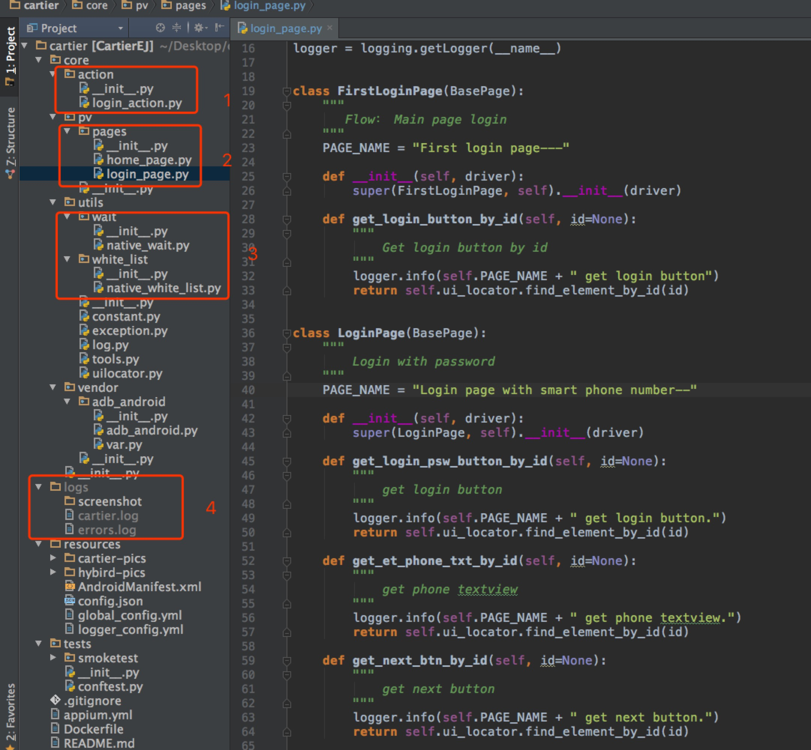
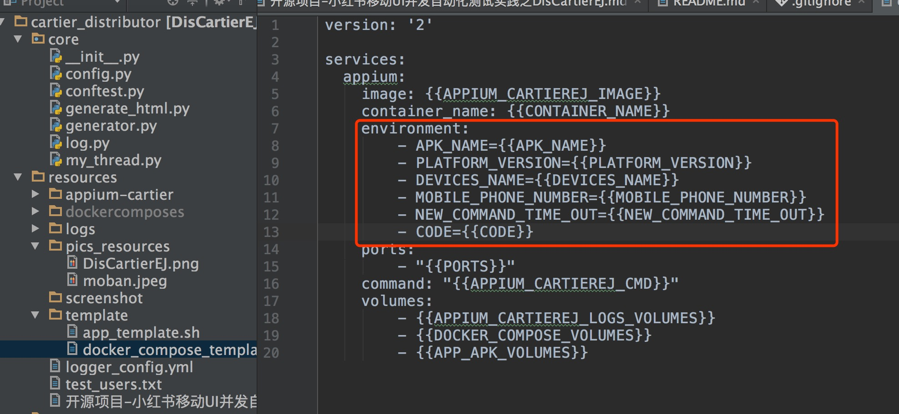

#开源项目：移动自动化测试框架DisCartierEJ之CartierEJ介绍
@ author Juan Liu 
@ Date 2017/06/04

## 背景介绍

在使用DisCartierEJ进行Case使用的时候，我们需要编写自己的Case，而对Case的编写是有要求的，这个要求并不是说，有额外的难度（相反可能是降低了难度）。主要是因为在DisCartierEJ从STF获取devices信息注入（render）到docker\_compose.yml模块中生成每一个设备对应的docker\_compose.yml，也就是注入到容器的环境变量中。而case需要将这些信息从环境中读取出来，这个时候就需要将相关的参数对应，而CartierEJ可以很好的获取这些信息。下面会仔细讲解这个方面。

DisCartierEJ和CartierEJ的关系是既不充分也不必要关系，只是两者结合可以更好的使用。

## CartierEJ是什么？

CartierEJ是一个尝试将移动UI自动化，进行规范化编写的”微框架“，以便于开发者可以很简单地开发。开发者只要按照已有的模板进行复制，修改就可以，增加效率，降低了成本。


## CartierEJ目标？

CartierEJ的目标是建立一个移动UI自动化开发模板。希望将开发测试工程师开发case的时间降低到半天以内（甚至半小时以内）。

## CartierEJ的项目结构

CartierEJ主要分为以下几个部分，PV、Action、Utility、Test三个部分。

1. PV是page页的结合，在编写的过程中，我们将一个app，分为主要的一些页面。比如，小红书APP，分为：login\_page、home\_page、main\_page、order\_page等，在每一个模块内，将一个页面的所有的元素包含在一个class类。
2. Action是将对每一页的操作结合，比如login_action模块，是对login_page上面元素的所有操作结合。
3. Utility主要包含两个模块，一个是wait模块，主要是用来进行对查找元素超时时候的一些操作，这个原来的webdriver模块包含，但是我们改了一下，所以单独拿出来了。
4. white_list这个模块要单独强调一下。在我们进行流程case运行的过程中，会出现一些额外的情况，比如出现更新框，出现弹框等，这个其实不是错误，但是会影响流程的执行。这个时候，我们做了一个白名单去处理这些情况，避免了额外的报错。

	比如，有的app会出现更新按钮框。这个时候，我们在白名单中如果已经包含了处理这个更新按钮，那么我们会点掉这个更新框，并将图截下来保存，然后继续执行。
5. Test模块，主要运行case的地方。
</img>
上图是框架的大概结构。
下图是实际的项目结构。
</img>

## DisCartierEJ如何与CartierEJ进行消息传递。
本地case代码要和Appium进行交流，需要desired\_capabilties。在DisCartierEJ中的case代码是在docker 的appium\_cartierej\_anriod的镜像里。这个时候，我们需要将从stf获取的信息传递给case，然后case得到整个信息和appium进行通信。

两者的通信，我们是通过，**环境变量**来实现的。这个可以从CartierEJ下tests的conftest.py文件可以得到。

	```
	@pytest.fixture(scope="session")
	def desired_caps(request):
	    """
	    Used to test multi devices
	    """
	    desired_caps = defaultdict(list)
	    desired_caps['platformName'] = 'Android'
	    try:
	        version = os.environ.get("PLATFORM_VERSION")
	        app_name = os.environ.get("APK_NAME")
	        devices_name = os.environ.get("DEVICES_NAME")
	    except KeyError:
	        logger.error("No environment variables for desired caps")
	        return None
	    if version is None or app_name is None or devices_name is None:
	        return None
	    desired_caps['platformVersion'] = version
	    desired_caps['app'] = app_name
	    desired_caps['deviceName'] = devices_name
	    desired_caps['newCommandTimeout'] = os.environ.get("NEW_COMMAND_TIME_OUT")
	    desired_caps['unicodeKeyboard'] = True
	    desired_caps['resetKeyboard'] = True
	    desired_caps['noReset'] = False
	    return desired_caps
	```
下面我们用一个实例来说明。
## Demo

### 首先我们看一下DisCartierEJ中的docker\_compose.yml的模板文件。
</img>
图中红色框框，就是一个手机需要的基本信息。这些信息需要从stf上获取。

### 使用项目中下的conftest.py模块中的get_stf_device方法得到devices 信息。
	
		def get_stf_devices(cond=None):
		    """
		    According conditions to filter devices on STF and return
		
		    :param cond: conditions to filter devices
		    :return: list of devices meeting conditions
		    """
		    logging.info("Get devices from stf platform.")
		    http_stf = Selector(url=v.STF_URL, token=v.TOKEN)
		    http_stf.load()
		    devices = http_stf.find(cond).devices()
		    logger.info("Devices length is : " + str(len(devices)))
		    return devices
其中的cond语句如何编写大家可以参考[使用stf_selector对stf的刷选](https://testerhome.com/topics/6939)，这个工具语法非常简单。
		
		cond = (where("present").exists()) \
           & (where("abi").exists()) \
           & (where("using").exists()) \
           & (where('present') == True) \
           & (where('using') == False)
    	devices = get_stf_devices(cond=cond)
这里的条件如下，然后我们就可以得到devices信息。然后render到模块中。主要的步骤就是先使用docker\_composes\_data，在使用generator\_docker\_composes方法即可。

最后会在resources/dockercomposes文件夹下生产各个设备的docker\_compose.yml。

结果如下：

		version: '2'
		services:
		  appium:
		    image: suifengdeshitou/appium-cartierej-android:latest
		    container_name: cdf1b667
		    environment:
		        - APK_NAME=/apk_shell/com.xingin.xhs-test-4.20.apk
		        - PLATFORM_VERSION=5.0
		        - DEVICES_NAME=xxx.xxx.xxx.xxx:7641
		        - MOBILE_PHONE_NUMBER=xxxxxxxxxxx
		        - NEW_COMMAND_TIME_OUT=60
		        - CODE=xxxx
		    ports:
		        - "4723"
		    command: "bash /app_shell/app.sh"
		    volumes:
		        - /Users/red/tmp/logs/cdf1b667:/opt/node/CartierEJ/logs
		        - /Users/red/PycharmProjects/DisCartierEJ/resources/dockercomposes/cdf1b667:/app_shell
		        - /Users/red/temp/appium:/apk_shell
		        
这个时候就会在每一个启动的容器内把设备的信息设置为环境变量。这个时候，case中的代码就会去取这些环境变量然后得到设备信息，然后连接appium进行交互。

**以上就是DisCartierEJ与CartierEJ之间的信息传递过程**

## 需要注意的两点

1. 下载CartierEJ编写完代码以后，要上传到自己的github上，并重新利用dockerfile去生产镜像（其实也就是在appium\_cartierej\_android镜像中使用新的代码）。
2. 需要修改config.py中相关信息，并把所需要的apk放在合适的位置。


## 延伸

GitHub上的CartierEJ只有Native的代码，在实际的过程中还需要webview相关的部分（在小红书内部已经基本实现了）。未来会慢慢地提交上去。

## 感受
自己想的和写出来的还是有点不一样的，写的要求更高，如果有不懂的地方，希望大家回复我。

## 其他
之前的DisCartierEJ，由于自己是新手，有个模块的功能有缺陷，不过已经修改了，如果之前你fork了，可以重新fork一下。